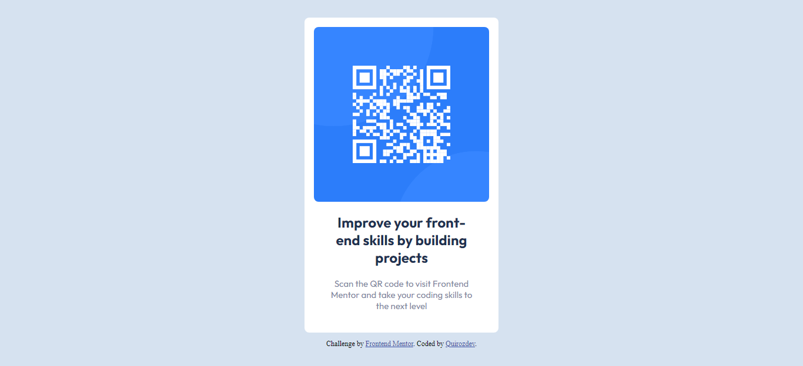

# Frontend Mentor - QR code component solution

This is a solution to the [QR code component challenge on Frontend Mentor](https://www.frontendmentor.io/challenges/qr-code-component-iux_sIO_H).

## Table of contents

- [Frontend Mentor - QR code component solution](#frontend-mentor---qr-code-component-solution)
  - [Table of contents](#table-of-contents)
  - [Overview](#overview)
    - [Screenshot](#screenshot)
    - [Links](#links)

## Overview

### Screenshot

### Links

- Solution URL: [Repository](https://github.com/Quirozdev/QRCodeComponent)
- Live Site URL: [Live Demo](https://quirozdev.github.io/QRCodeComponent/)
